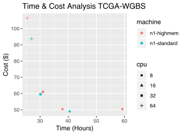
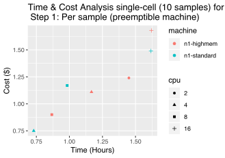
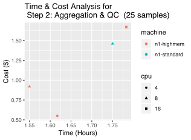
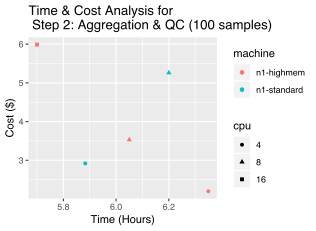

# Firecloud/WDL DNA methylation workflows
<p align="justify">
This repository <a href="https://github.com/aryeelab/dna-methylation-tools">https://github.com/aryeelab/dna-methylation-tools</a> contains a suite of tools to conduct DNA methylation data analysis. It is maintained by Divy Kangeyan at the <a href="http://aryee.mgh.harvard.edu">Aryee Lab</a>
</p>

<p align="justify">
This platform contains publicly accessible cloud-based preprocessing and quality control pipelines that go from raw data to CpG-level methylation estimates. The technologies covered include Whole Genome Bisulfite Sequencing (WGBS), Reduced Representation Bisulfite Sequencing (RRBS) and Hybrid Selection (capture) Bisulfite Sequencing (HSBS). Leveraging the Firecloud platform allows users to:
</p>

 <ol>
<li>Ensure cross-platform reproducibility of analyses</li>
<li>Achieve scalability to large whole genome datasets with 100GB+ of raw data per sample, and to single-cell datasets with thousands of cells</li> 
<li>Provide access to best-practice analysis pipelines</li>  
<li>Enable integration and comparison between user-provided data and publicly available data (e.g. TCGA)</li>
</ol>


## Workflow steps
Analysis should be run in two successive processes: 

<ol>
<li>Per-sample preprocessing</li>
<li>Aggregation and quality control analysis</li>
 </ol>

## Getting started
<p align="justify">
If you plan to use the WDL workflows in your local computing environment, then this repository should be cloned. If you are using FireCloud, then you should either clone the FireCloud workspace <b>aryee-lab/dna-methylation</b> or if you already have your own workspace you can import the method configuration of your interest from <b>aryee-lab/dna-methylation</b> workspace.
 </p>

## Uploading the files to FireCloud
<p align="justify">
FASTQ files and target coverage files can be uploaded to FireCloud using gsutil (https://pypi.org/project/gsutil/)
 </p>

## Participant and Participant Set file
<p align="justify">
Before running the processes, you need to generate participants file and participant_set file. Each line in participant file specify a single sample. entity:participant_id column specificy the sample name and two subsequent columns are for paired end FASTQ file. If one sample has multiple FASTQ files for different lanes or runs they can be added in the same column with comma separation. Each line in participant_set file specify a set of samples that should be aggregated and analyzed together. First column in the participant_set file is the name of the participant_set and second column indicates the participant_id/sample name. Both of these files are tab separated text files. Examples of these files are shown in <i>Firecloud_imports</i> subdirectory.
</p>

## Alignment and methylation calling
<p align="justify">
In order to perform alignment and methylation calling choose <i>bismark_rrbs</i>, <i>bismark_wgbs</i> or <i>bismark_hsbs</i> method configuration with appropriate reference genome suffix. As the name indicates <i>bismark_rrbs</i> is for samples that are generated from Reduced Representation Bisulfite Sequencing (RRBS) with Mspl digestion and <i>bismark_wgbs</i> is for data generated from Whole Genome Bisulfite Sequencing (WGBS). <i>bismark_hsbs</i> is for data generated from Hybrid Selection Bisulfite Sequencing (HSBS). These worflows can also combine fastq files from multiple lanes if the samples are sequenced in such a way.
 </p>

<ol>
<li>Upload the fastq files to the Google cloud bucket</li>
<li>Upload additional files such as target coverage bed file for HSBS sequencing</li>
<li>In the FireCloud workspace choose <i>bismark_rrbs</i>, <i>bismark_wgbs</i> or <i>bismark_hsbs</i> method configuration with appropriate reference genome suffix</li>
<li>Change other parameters according to preference</li>
<li>Press <i>Launch Analysis</i> in upper right hand corner</li>
<li>Choose the participants from the list of files</li>
<li>Click <b>Launch</b></li>
 </ol>


If you are interested in conducting alignment and methylation calling for an entire participant set. Choose the participant set and in the box named **Define expression** type *this.participants*


You can observe the status of the job by going to *Monitor* tab

### Alignment and methylation calling specific parameters
```
r1_fastq & r2_fastq
```
- Paired end FASTQ files

```
samplename
```
- base name for a sample

```
genome_index
```
- Reference genome to conduct bisulfite specicfic alignment

```
n_bp_trim_read1 & n_bp_trim_read1
```
- Number of bases to trim in read 1 and read 2. This is only specified for wgbs and hsbs workflows. rrbs workflow uses the --rrbs option from trimGalore.

```
chrom_sizes
```
- chrom_sizes file in order to generate the BIGWIG file


## Aggregation and Quality Control Analysis
After the alignment and methylation calling each sample will have their methylation information and metadata stored in HDF5 format

In order to aggregate all of them and obtain the quality control report
<ol>
<li>Choose <i>aggregate_bismark_output</i> method configuration with appropriate reference genome suffix</li>
<li>Change other parameters according to preference</li>
<li>Save it and press <i>Launch Analysis</i> </li>
<li>Since root entity type in aggregation step is participant set, you will choose participant_set with participants of your interest</li>
<li>Finally click <b>Launch</b></li>
</ol>

To check the results from any of the work flows, go to Monitor tab, click *View* in the Status columns and then click the *Workflow ID* in the bottom of the page.

### Aggregation specific parameters
```
in_pe_reports_files
```
- Report files from the bismark alignment

```
in_covgz_files
```
- coverage output file

```
in_mbias_files
```
- M-bias file

```
BSGenome_targz
```
- BSGenome targz file

```
BSGenome_package
```
- Name of the BSGenome package

```
Genome_build
```
- Name of the genome build, e.g. mm10, hg19 etc. 


### General parameters
```
cpu
```
- Number of CPUs

```
disks
```
- Name of the disk (Depends on the disk size)

```
memory
```
- Memory requirement

```
multicore
```
- Number of cores to use, especially during alignment

```
preemptible
```
- Preemptible option is to use preemptible virtual machine, if it is set to 0 the workflow runs uninterrupted. If it is set to any integer other than zero it may be interpreted that many times. However preemtible option reduces the computing cost significantly.

### WDL specifications for the workflows

The per-sample preprocessing WDL workflow input parameters consist primarily of input file names and the Bismark genome index to use. A subset of the outputs from this step (Mbias files and methylated and unmethylated read coverage tables) are passed on as inputs to the subsequent aggregation and QC WDL workflow which in turn produces a QC report, aggregated methylation tables and a Bioconductor (bsseq) object. All tasks specify runtime parameters including disk size, CPU and memory requirements, and the docker image version to be executed.

## scmeth
Quality control analysis is conducted via the bioconductor package <a href="http://bioconductor.org/packages/release/bioc/html/scmeth.html">scmeth</a>. QC analysis can be done independently with this package given that you have the appropriate objects.


## Running the WDL workflow in local environment
### Setup

1. Clone this repository

```
git clone aryeelab/dna-methylation-tools
```

2. Change the directory

```
cd dna-methylation-tools
```


3. If you want to run the examples below, download this small genome index and chrom.sizes file for mm10_chr 19: 

```
wget https://storage.googleapis.com/aryeelab/bismark-index/mm10_chr19/bismark_mm10_chr19.tar.gz
```

```
wget https://storage.googleapis.com/aryeelab/chrom.sizes/mm10_chr19.chrom.sizes
```

### Running the WDL workflow in Cromwell

Note: On Mac, cromwell can be installed with the following command
```
brew install cromwell
```

Following commands are based on cromwell version 30. 

**Edit the file paths for FASTQ files, genome index, chrom.sizes file and monitoring script in the json file according to your directory paths to run the test sample.**

```
{
  "call_bismark_pool.r1_fastq": "[INSERT ABSOLUTE PATH]/dna-methylation-tools/testdata/small_01_R1.fastq.gz",
  "call_bismark_pool.r2_fastq": "[INSERT ABSOLUTE PATH]/dna-methylation-tools/testdata/small_01_R2.fastq.gz",
  "call_bismark_pool.chrom_sizes": "[INSERT ABSOLUTE PATH]/dna-methylation-tools/mm10.chrom.sizes",
  "call_bismark_pool.monitoring_script": "[INSERT ABSOLUTE PATH]/dna-methylation-tools/monitor.sh",
  "call_bismark_pool.genome_index": "[INSERT ABSOLUTE PATH]/dna-methylation-tools/bismark_mm10_chr19.tar.gz"
    
}
```


#### WGBS, Paired-end reads
```
java -jar cromwell-30.2.jar run bismark_wgbs.wdl -i bismark_wgbs.json
```

#### RRBS, Paired-end reads
```
java -jar cromwell-30.2.jar run bismark_rrbs.wdl -i bismark_rrbs.json
```


#### HSBS, Paired-end reads
```
java -jar cromwell-30.2.jar run bismark_hsbs.wdl -i bismark_hsbs.json
```

#### Aggregation workflow
```
java -jar cromwell-30.2.jar run aggregate_bismark_output.wdl -i aggregate_bismark.json
```

#### Single-end reads (Out of date)
```
java -jar cromwell-30.2.jar run bsseq_preprocess_se.wdl -i sample1_se.json
```

### Cost & Time Analysis in FireCloud
We estimated the time and cost for Whole Genome Bisulfite Sequencing (WGBS) sample from TCGA that contains approximately 290 million reads.



Also following plot shows the time & cost estimates for single cell samples in non-preemptible machine

For 10 sample set: samples were sequenced with a median of 741,214 reads (range of 414,443 to 1,825,672)

For 25 sample set: samples were sequenced with a median of 1,044,720 reads (range of 10,507 to 3,644,360)

 

Plots below are for same sample set but in preemptible machine

 

We also conducted similar analysis for the aggregation step

  

## TCGA data
We have preprocessed and made available 47 WGBS samples available from TCGA. The raw (FASTQ) data, processed data and workflows are made available in a FireCloud workspace (See https://portal.firecloud.org/#workspaces/aryee-merkin/TCGA_WGBS_hg19). 

## Questions and Comments
Please use the Github Issues tracker with any issue you face with the platform. Any specific questions or comments, contact me at <a href="mailto:divyswar01@g.harvard.edu">divyswar01@g.harvard.edu</a>
